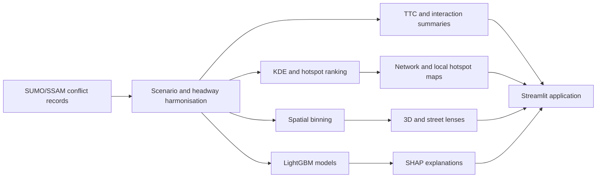

# Mobility Safety Intelligence

An interactive research application for turning microscopic SUMO conflict outputs into interpretable traffic-safety evidence.

**Live demonstrator:** [mobility-safety-intelligence.streamlit.app](https://mobility-safety-intelligence.streamlit.app/)

The project was developed by **Amirhossein Taheri** as part of his PhD research at Technische Universitaet Berlin. It combines surrogate-safety analysis, spatial hotspot exploration, explainable machine learning, and interactive network visualisation. The application is an offline analytical layer over prepared SUMO outputs; it is not a live traffic digital twin and does not predict observed crashes.

## What the software does

- Compares 12 fleet-composition scenarios across desired headways of 0.6, 0.8, and 1.0 seconds.
- Summarises TTC-based simulated conflict indicators and vehicle interaction characteristics.
- Locates and ranks conflict concentrations across the Berlin study network.
- Converts SUMO metric coordinates to geographic coordinates for map interpretation.
- Provides clickable hotspot maps, local 3D conflict landscapes, a whole-network 3D view, and street-context lenses.
- Displays buildings, roads, traffic signals, crossings, public-transport context, water, and green areas derived from OpenStreetMap.
- Serves precomputed LightGBM regression and classification results for microscopic, policy-lever, and combined feature modes.
- Uses SHAP to describe predictive associations while explicitly avoiding causal claims.
- Adds an interactive, DOI-linked literature benchmark from Taheri et al. (2026), with the published sensitivity-adjusted MPR-SIR points kept separate from the Berlin SUMO outputs.
- Provides a grounded research assistant that uses prepared evidence and references, with optional server-side OpenAI synthesis.
- Includes optional original acoustic and electronic setar-inspired sound sketches, plus restrained game-interface sounds. Music and effects are independently controlled and off by default.

## From data to output



## Code map

| Purpose | Implementation |
| --- | --- |
| Streamlit user interface and safety summaries | `app/dashboard.py` |
| Hotspot selection and clickable overview | `hotspot_table`, `hotspot_map_points`, and `hotspot_pydeck_chart` in `app/dashboard.py` |
| Local 3D conflict landscape | `build_local_3d_conflict_bins` and `local_conflict_landscape_3d_chart` |
| Whole-network 3D landscape | `build_whole_area_3d_bins`, `whole_area_conflict_landscape_3d_chart`, and `whole_area_conflict_street_map_3d_chart` |
| Street-context lens | `build_whole_network_street_cells` and `whole_network_street_lens_chart` |
| Camera rotation and bar visibility | `render_3d_camera_controls`, `rotate_3d_camera`, and `reset_3d_camera` |
| Standardised Gaussian KDE and ranked peaks | `scripts/generate_kde_maps.py` |
| LightGBM preparation, grouped validation, caching, and SHAP | `app/ml_modeling.py` |
| Offline generation of all model combinations | `scripts/precompute_lightgbm_shap.py` |
| Reproducible ML quality checks | `notebooks/lightgbm_shap_data_quality.ipynb` |

For methodological details, see [docs/METHODS.md](docs/METHODS.md). For the repository structure and extension points, see [docs/ARCHITECTURE.md](docs/ARCHITECTURE.md).

## Run locally

Python 3.11 or 3.12 is recommended.

```powershell
python -m venv .venv
.\.venv\Scripts\Activate.ps1
python -m pip install -r requirements.txt
streamlit run app/dashboard.py
```

The local application will normally open at `http://localhost:8501`. The public demonstrator is available at [mobility-safety-intelligence.streamlit.app](https://mobility-safety-intelligence.streamlit.app/).

### Public demonstrator data

The public repository contains `data/demo_conflicts.csv`, a deterministic stratified sample covering all 12 scenarios and all three headways. If the three complete research tables are unavailable, the dashboard automatically enters **demonstrator mode** and uses this sample. Prepared LightGBM/SHAP artifacts remain clearly labelled as results generated offline from the complete research dataset.

The complete event tables and the 262 MB collection of generated hotspot HTML files are not part of the public Git history. The hotspot workflow remains documented and reproducible from authorised data. The full materials may be released later after a separate data-release decision.

## Reproduce the spatial KDE

The following command rebuilds standardised KDE surfaces and a ranked-hotspot table from the three headway datasets:

```powershell
python scripts/generate_kde_maps.py --output-dir outputs/kde
```

The implementation uses a 25 m grid, a fixed 150 m Gaussian bandwidth, a common metric coordinate system, and a minimum 750 m separation between selected peaks. These defaults can be changed through command-line options.

## Rebuild the offline LightGBM and SHAP cache

```powershell
python scripts/precompute_lightgbm_shap.py
```

The script prepares regression and selected short-TTC classification artifacts for:

- microscopic variables;
- policy levers;
- combined variables;
- each headway separately; and
- all headways together.

Visitor sessions load the resulting artifacts and never retrain the models.

## Original audio

The app's music and interface sounds are generated locally by
`scripts/generate_audio_assets.py`. They are original synthetic assets—not sampled
recordings and not reproductions of an existing composition or performer. The loops
are described as **setar-inspired sound sketches**, rather than authentic traditional
performances. Regenerate them with:

```powershell
python scripts/generate_audio_assets.py
```

## Optional OpenAI synthesis

The dashboard works without an API key. To enable server-side synthesis, copy `.streamlit/secrets.example.toml` to `.streamlit/secrets.toml` and add your own key. Never commit `secrets.toml`. See [OPENAI_SETUP.md](OPENAI_SETUP.md).

## Scientific interpretation

- TTC is a surrogate safety indicator, not an observed crash count.
- Conflict points are simulated events, not recorded crash locations.
- The literature benchmark is cross-study evidence. Its Safety Improvement Rate values are not interchangeable with local conflict counts or severe-conflict shares.
- KDE measures absolute simulated event concentration and is not exposure-normalised local risk.
- SHAP values describe model behaviour and predictive associations; they do not establish causal policy effects.
- Findings are bounded to the tested network, demand, behavioural assumptions, fleet compositions, and headway settings.

## Data and map attribution

The source code is available under the MIT License. Research data and generated model artifacts are not automatically covered by the code licence; see [DATA_LICENSE.md](DATA_LICENSE.md).

Street context is derived from OpenStreetMap and must retain OpenStreetMap attribution. See [NOTICE.md](NOTICE.md).

The literature-benchmark values are attributed to Taheri et al. (2026), [doi:10.1186/s12544-026-00774-9](https://doi.org/10.1186/s12544-026-00774-9), published open access under [CC BY 4.0](https://creativecommons.org/licenses/by/4.0/). The displayed power equation is clearly labeled as a reconstruction from the article's rounded adjusted points, not as the exact printed coefficient equation.

## Citation

Citation metadata are provided in [`CITATION.cff`](CITATION.cff). GitHub's citation panel points to the current SSRN preprint as the preferred scientific citation. When the journal article is published, this entry will be updated to the final DOI. A DOI-backed software release can also be created later through Zenodo.

If you use the software, methods, visualisations, demonstrator data, or derived outputs in academic work, please cite both the software and the associated paper:

> Taheri, Amirhossein. *Mobility Safety Intelligence*, version 0.1.0, 2026, https://github.com/amirhosseintaheri93-collab/mobility-safety-intelligence.

> Taheri, Amirhossein, Anton Dorn, Arastoo Karimi, Edgar Budde, Dimitris Milakis, and Steffen Mueller. “How Do Automated Vehicle Penetration, Vehicle-Size Composition, and Desired Headway Shape Urban Traffic Conflict Patterns? An Analysis Using a Calibrated Microsimulation Model.” SSRN preprint, 2026. https://papers.ssrn.com/sol3/papers.cfm?abstract_id=7025301.
